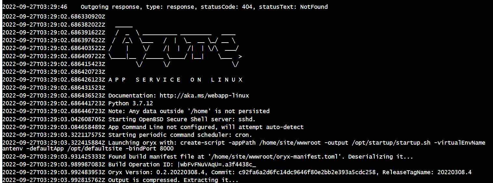

# Overview

This is the project of Azure Devops Engineer Nanodegree Udacity.  
In this project, we will build a CI/CD pipeline using Github action and Azure Pipeline for a Python-base application

## Project Plan

* A link to a Trello board for the project:
    - [Trello link](https://trello.com/b/NhWIheUO/project-planning)
* A link to a spreadsheet that includes the original and final project plan>  

## Instructions

* Architectural Diagram (Shows how key parts of the system work)>  

<TODO:  Instructions for running the Python project.  How could a user with no context run this project without asking you for any help.  Include screenshots with explicit steps to create that work. Be sure to at least include the following screenshots:

* Clone project into Azure Cloud Shell
    - Open Azure Cloud Shell, create a SSH key pair by: `ssh-keygen -t rsa`;
    - Add public SSH key to your Github. If you don't know how to add, you can go throuh this [Add SSH key to Github Account](https://www.inmotionhosting.com/support/server/ssh/how-to-add-ssh-keys-to-your-github-account/) 
    - Clone source code to Azure Cloud Shell: ` git clone <your project link> `

* Project running on Azure App Service
    - Go to project directory and run `make setup`
    - Activate virtual env: `source ~/.udacity-devops/bin/activate`
    - Run `make all` command

* Deploy project to web service using Azure Cloud Shell
    - Go to project directory and run `az webapp up --name <Your_unique_app_name> --resource-group Azuredevops --runtime "PYTHON:3.7"`

    - Update `<yourappname>` in file `make_predict_azure_app.sh`
    - Run the command `chmod u+x make_predict_azure_app.sh`
    - Run: `./make_predict_azure_app.sh`

* Setup Github Action:

* Build CD using Azure Pipline
    - Create and SSH to VM:

    - Follow this [link](https://praveenkumarsreeram.com/2021/04/14/azure-devops-configure-self-hosted-agent-for-azure-pipelines/) to create self-host agent:

    - Create service connection:

    - Create Pipline using template from [azure-pipelines.yml](../../../../azure-pipelines.yml)

* Running Azure App Service from Azure Pipelines automatic deployment

* Successful prediction from deployed flask app in Azure Cloud Shell.  [Use this file as a template for the deployed prediction](https://github.com/udacity/nd082-Azure-Cloud-DevOps-Starter-Code/blob/master/C2-AgileDevelopmentwithAzure/project/starter_files/flask-sklearn/make_predict_azure_app.sh).
The output should look similar to this:

* Output of streamed log files from deployed application

> 

## Enhancements

* Deploy project using Docker or Kubernetes

## Demo 

<TODO: Add link Screencast on YouTube>

